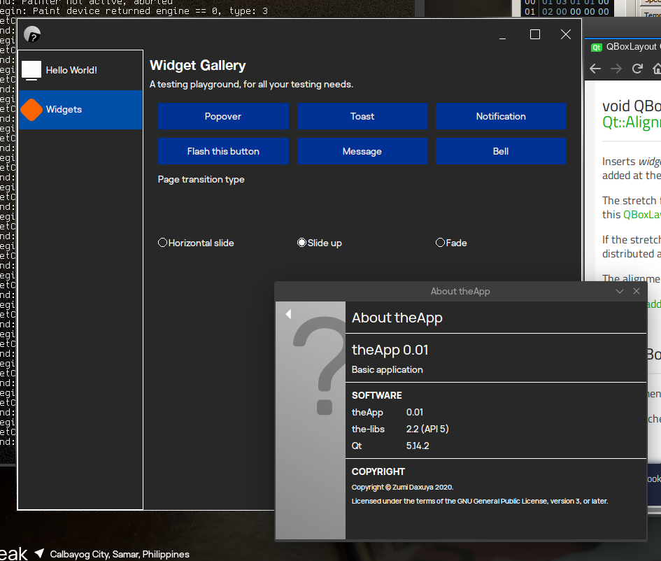

# theApp

An example 3rd-party application for [Victor Tran's theSuite](https://github.com/vicr123).

Contains a demo subproject containing some widget demos and a barebones
subproject as a basis for apps.

## Requirements

* Qt 5
* qmake
* [the-libs](https://github.com/vicr123/the-libs)

## Build

`mkdir build && cd build`

`qmake .. && make`

If a build is successful:
    * Demo application will be in `build/app-demo/theapp-demo`.
    * Barebones application will be in `build/app-barebones/theapp`.

## Packaging

Currently an example [PKGBUILD](https://gist.github.com/ZoomTen/2853266b2060d563654cffa9dbcb1d49) is available for Arch Linux and derivatives.

## Make it yours

Clone (not fork) this repo:
    * **GitHub**: click "Use this template"
    * **Plain Git**: `git clone https://github.com/ZoomTen/theApp/; cd theApp; rm -r .git; git init;`

Then delete the `app-demo \` line in theApp.pro and delete the `app-demo` folder.

From this point on, all you do is up to your imagination! (and skill!)

## Documentation

[Wiki](https://github.com/zoomten/theapp/wiki) is coming up soon...
